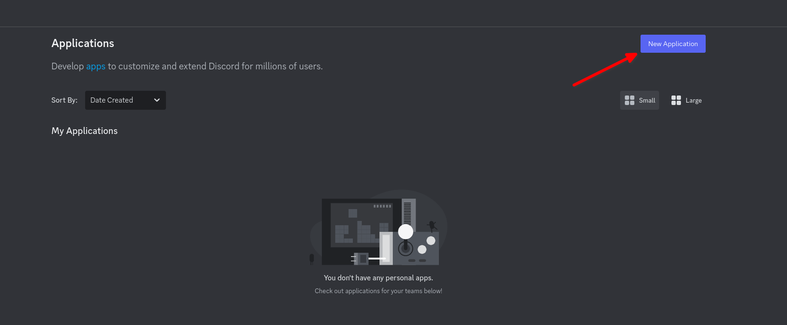
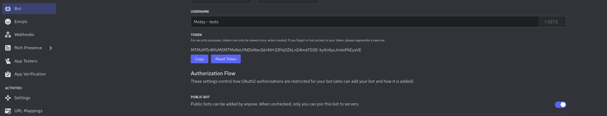
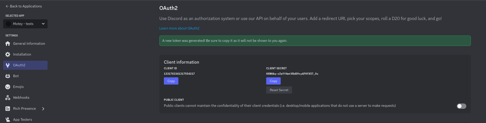
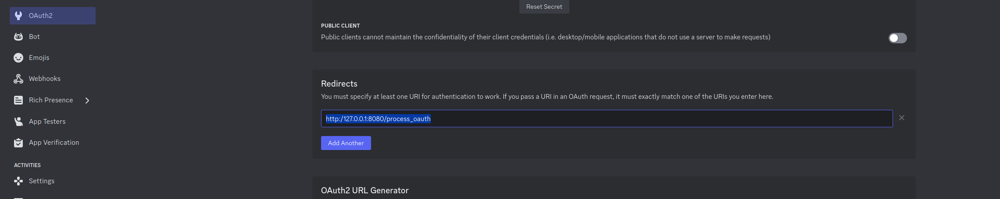
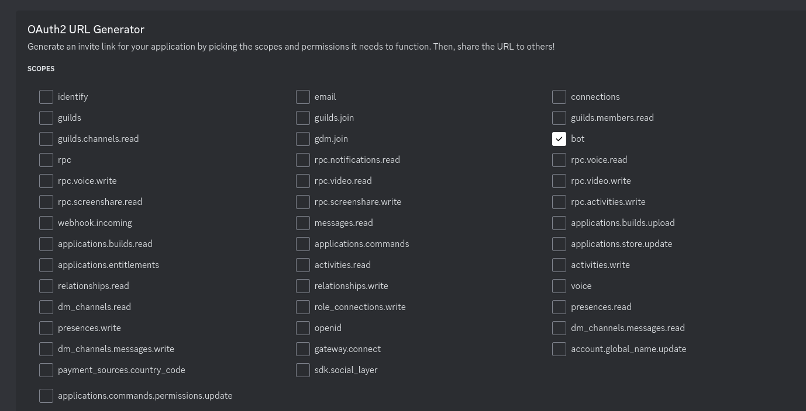
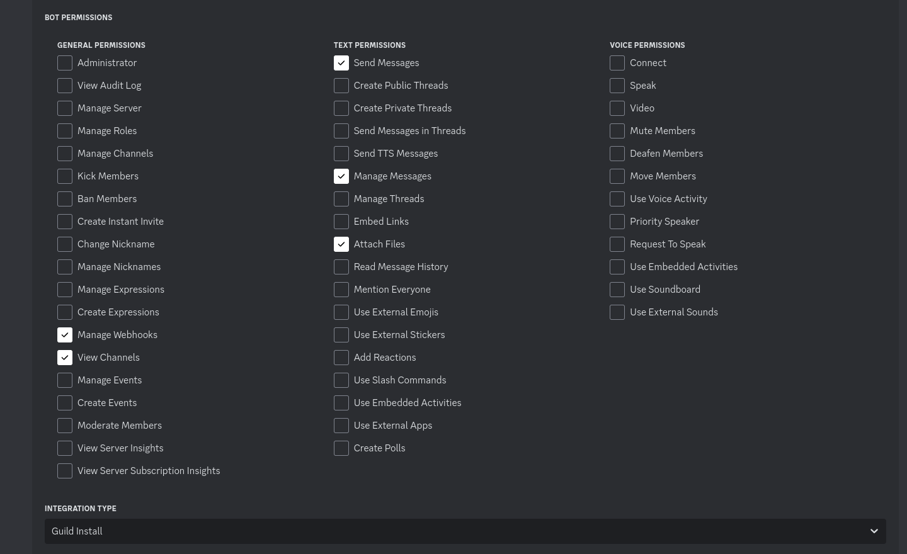
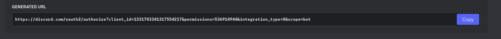

# Motey

## Showcase: [https://diode.zone/w/aXNYaER47MnTu8uw4LZSFW](https://diode.zone/w/aXNYaER47MnTu8uw4LZSFW)

## Discord bot setup

- Go to https://discord.com/developers/applications and create a new app
- 
- In the Bot section copy your bot token
- 
- Enable the message content intent
- 
- In the OAuth2 section copy your client id and secret
- 
- Add the redirect url, for the default .env the correct url is: http://127.0.0.1:8080/process_oauth
- 
- In the url generator enable the bot scope
- 
- Set the integration type to Guild install and enable the following permissions: Manage Webhooks, View Channels, Send Messages, Manage Messages, Attach Files
- 
- Copy the generated url and use it to add the bot to your server
- 

## Setup

* Create .env file from template:
```shell
cp .env.dist .env
```
Replace default variables with your own, note that most default values will work just fine for local testing/development environments:

* Run the script:
```shell
./setup.sh
```

## Run

### Local/Testing:

* Source the script:
```shell
source run_local.sh
```

### Production:

* Change the domain in `Caddyfile`
* Run the script:
```shell
./run_prod.sh
```
